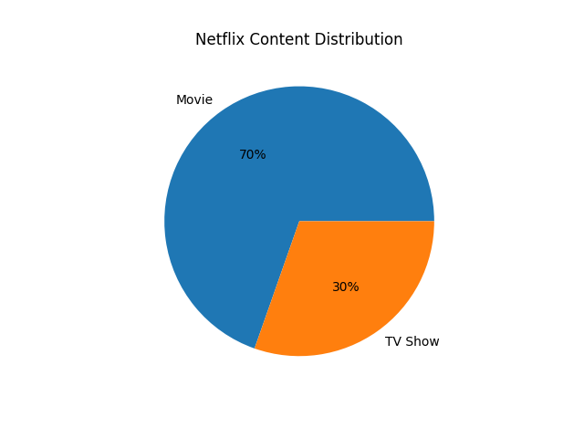
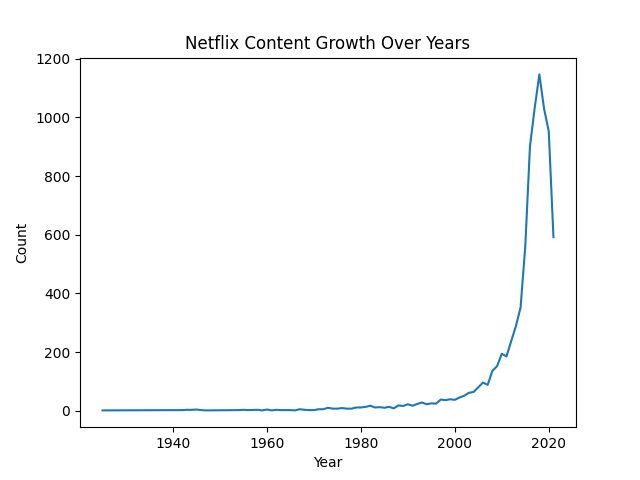
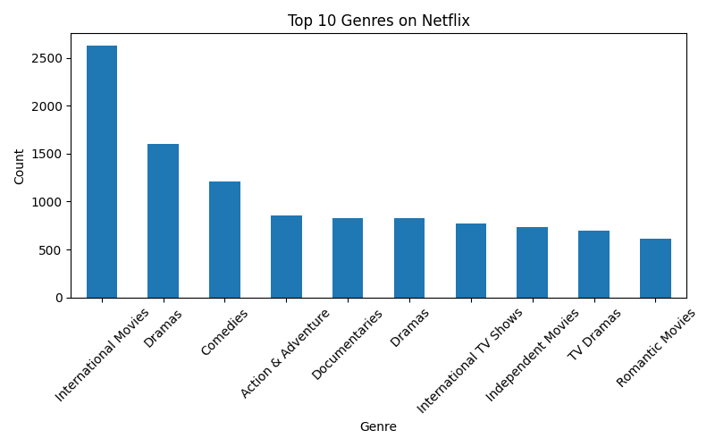
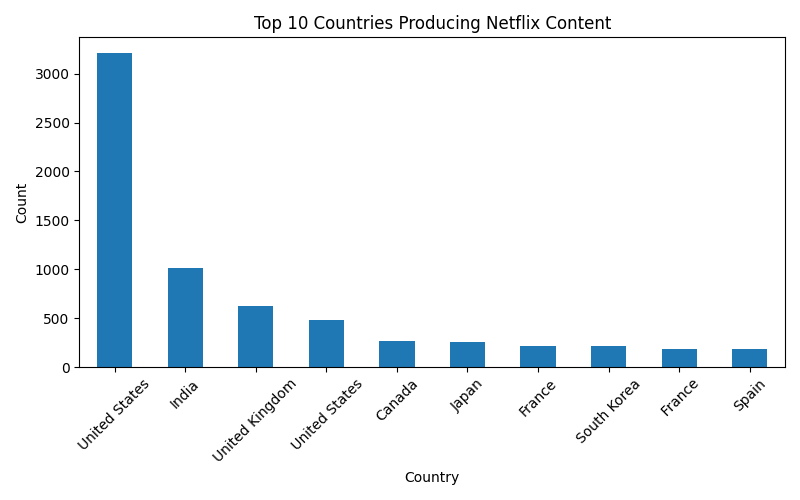

# Netflix Data Analysis using Python

This project analyzes Netflix content using **Python, Pandas, and Matplotlib**.

The goal of this project is to explore trends in Netflix movies and TV shows and visualize insights using data analysis.

---

## Tools & Technologies

- Python
- Pandas
- Matplotlib
- Data Visualization
- Data Cleaning

---

## Dataset

Netflix Movies and TV Shows Dataset (CSV)

Columns include:
- Title
- Type (Movie / TV Show)
- Release Year
- Country
- Genre
- Duration

---

## Analysis Performed

1. Netflix Content Distribution (Movies vs TV Shows)
2. Netflix Content Growth Over Years
3. Top Genres on Netflix
4. Top Countries Producing Netflix Content

---

## Visualizations

### Content Distribution


### Content Growth


### Top Genres


### Top Countries


---

## Project Structure

```
Netflix-Python-Analysis
│
├── charts
│   ├── content_distribution.png
│   ├── content_growth.png
│   ├── top_genres.png
│   └── top_countries.png
│
├── netflix_analysis.py
├── netflix_titles.csv
└── README.md
```

---

## Author

Sohail

Aspiring Data Analyst | Python | Data Visualization
# Netflix Data Analysis Dashboard

This project analyzes Netflix Movies and TV Shows dataset using Microsoft Excel.

## Tools Used
- Microsoft Excel
- Pivot Tables
- Pivot Charts
- Data Cleaning

## Dataset
Netflix Movies and TV Shows Dataset

## Key Insights
• Movies make up around 70% of Netflix content
• Content growth increased significantly after 2015
• Drama and International TV Shows are among the top genres
• United States produces the highest Netflix content

## Dashboard Preview


